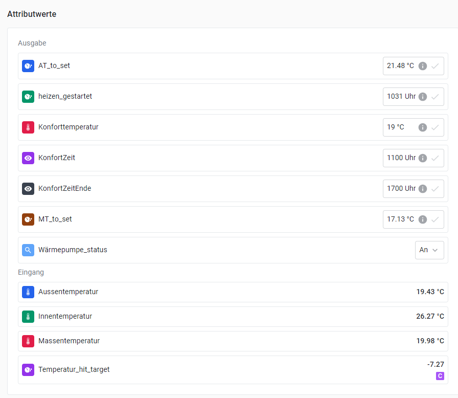

# 🔥 Heating Optimization Script for Eliona System

This script optimizes the heating start time to ensure the desired comfort temperature is reached by a specified time. Using outdoor and mass temperatures, the script calculates and records the ideal time for heating activation. It continuously updates a CSV table that helps fine-tune heating activation based on historical performance.

---

## 📋 How the Script Works

1. **CSV Initialization and Temperature Mapping**:
   - The script uses a CSV file (`temp_min_data.csv`) to store values that represent the ideal pre-start time in minutes for heating activation, based on various combinations of outdoor and mass temperatures. 
   - If this file doesn’t exist, it’s created with default values for each temperature pairing, allowing the system to adapt over time.

2. **Comfort Time Calculation**:
   - The user specifies a **comfort time** (e.g., 08:00), which is the time by which the indoor space should reach the desired comfort temperature.
   - The script determines the current outdoor and mass temperatures, then checks the CSV to find the optimal lead time (in minutes) needed to start heating to reach the comfort temperature by the specified time.

3. **Heating Activation Logic**:
   - The script compares the calculated start time to the current time. If the difference between the two indicates that heating needs to start, it activates the heating system by setting a status attribute in Eliona.
   - Additional conditions, like checking if the indoor temperature is already above the comfort temperature, prevent unnecessary heating activations.

4. **Adaptive CSV Table Updates**:
   - Once the indoor temperature reaches the comfort target, the script calculates the actual time it took to reach this temperature from the heating start.
   - This time is then weighted and used to update the CSV entry for the specific combination of outdoor and mass temperatures, refining the lead-time accuracy for future heating cycles.

In essence, this script uses temperature data and historical performance to optimize the heating start time, ensuring comfortable indoor temperatures exactly when needed while improving efficiency based on actual environmental feedback.
   
---

## 🔎 Optimization Concept

This script uses an adaptive table to improve heating activation timing:
- **Temperature-based Time Calculation**: By examining outdoor and mass temperatures, the script determines how early the heating should start to reach the comfort temperature by a specified time.
- **Adaptive CSV Table**: The table is updated over time with a weighted value that reflects the actual time taken, allowing it to adapt based on real-world performance.

### Example:
1. **User-defined Comfort Time**: If the user sets the comfort time to 8:00 (0800), the script calculates if heating should be activated based on the outdoor and mass temperatures.
2. **Heating Activation**: If the combination of current time plus the minutes from the CSV table exceeds the comfort time, the script activates the heating.
3. **CSV Update**: Once the desired temperature is reached, the table value for the original temperatures (outdoor, mass) is updated with the weighted actual time taken to reach comfort.
4. **Stop heating**: If it is past the comfort end time the heating will be turned off.

---

## 📋 Setup Instructions

### 1. Eliona API Key and Host

- Obtain an **API Key** from Eliona to allow the script to interact with the system.
  - Replace `"YOUR_ELIONA_API_KEY"` in the `api_key` variable.
- Set the **host URL** for your Eliona platform.
  - Replace `"https://your.eliona.host/api/v2"` with your Eliona URL.

### 2. Asset Setup in Eliona

- **Create an Asset** in Eliona with attributes that match the following names:
  - **Output Attributes**:
    - `AT_to_set`: Target outdoor temperature.
    - `heizen_gestartet`: Heating start time.
    - `Konforttemperatur`: Desired comfort temperature.
    - `KonfortZeit`: Comfort time (the time by which the target temperature should be reached).
    - `KonfortZeitEnde`: End time for the comfort period.
    - `MT_to_set`: Target mass temperature.
    - `Wärmepumpe_status`: Status of the heat pump (on/off).
  - **Input Attributes**:
    - `Aussentemperatur`: Current outdoor temperature.
    - `Innentemperatur`: Current indoor temperature.
    - `Massentemperatur`: Current mass temperature.
    - `Temperatur_hit_target`: Indicator for whether the target temperature has been reached.

- **Attribute Calculations**:
  - For the `Temperatur_hit_target` attribute, use the following calculation in Eliona’s attribute calculator:
    ```go
    {output.Konforttemperatur} - {input.Innentemperatur}
    ```
  - This will dynamically track the difference between the comfort temperature and the current indoor temperature.

  Here’s an example of how the attribute setup might look:

  

### 3. Asset ID

Define the **Asset ID** of the Eliona asset for tracking heating data:

```python
  asset_id = 439  # Replace with your actual Eliona asset ID
```

### 4. Adjust Temperature Ranges and Initial Values

Adjust temperature ranges and values for initialization based on your requirements:

- **Outdoor temperature range (`at_range`)**: `range(-5, 41)` to cover temperatures from -5°C to 40°C.
- **Mass temperature range (`mt_range`)**: `range(8, 27)` to cover temperatures from 8°C to 26°C.
- **Weight (`tb_up_wght`)**: Factor to adjust values in the CSV based on actual elapsed time to reach comfort.
- **Initial Value (`tb_init_val`)**: Default starting value in the CSV for heating time.

### 5. Configure Comfort Settings

- Input the **desired comfort temperature**, **comfort time**, and **comfort end time** into the respective attributes in Eliona. These values will serve as targets for the script to ensure the heating system reaches the specified temperature at the specified time.

### 6. Script Scheduling

- **Schedule**: Run the script periodically (e.g., every 15 minutes) to continuously monitor and adjust the heating system.
  - Ensure script execution aligns with Eliona’s settings to optimize comfort temperature control.

By following these steps, you’ll set up the asset and attributes in Eliona, configure the necessary settings, and schedule the script to optimize heating control based on dynamic conditions.

---

## 📊 CSV Table Structure

The CSV file logs data on the time needed for heating based on temperature. Each row represents an outdoor temperature (`AT`) with mass temperature columns (`MTxx`).

- **Columns**:
  - `AT`: Outdoor temperature range.
  - `MTxx`: Mass temperature range, with `xx` as the temperature value.
  
**Example Table Structure**:

AT,MT8,MT9,...,MT26  
-5,300,300,...,300  
-4,300,300,...,300  
...  
40,300,300,...,300  

---

## 🔗 Resources

- [Eliona API Documentation](https://doc.eliona.io/)
- [Eliona Platform](https://eliona.io)

Ensure asset and attribute configurations in Eliona match the script’s requirements for accurate operation and reliable data handling.
